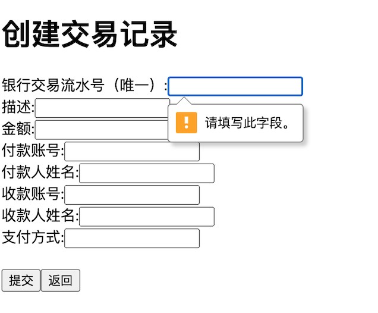

# transaction-management

## 项目概述
一个用于管理交易记录的项目，它提供了创建、读取、更新和删除交易记录的基本功能。该项目使用 Java 开发，结合 Spring Boot 框架，前端采用 React 进行构建。

### 项目访问地址
在线演示访问地址（阿里云服务器2c2g配置，Docker 26.1.3）：
访问路径: http://47.109.133.74/

### 本地运行

- **前端**：在transaction-management-frontend目录下先之行npm install安装依赖，再执行npm start
- **后端**:本地启动springboot

访问路径: http://localhost:3000/

### 容器部署

docker容器部署

1. 构建前端Docker镜像：
    ```sh
    docker build -t frontend-image:1.0 .
    ```

2. 运行前端Docker容器：

    ```sh
    docker run -d -p 80:80 --name frontend-container frontend-image:1.0
     ```
3. 构建后端Docker镜像：
    ```sh
    docker build -t backend-image:1.0 .
    ```

4. 运行前端Docker容器：

    ```sh
    docker run -d -p 8080:8080 --name backend-container backend-image:1.0
     ```
5. 运行nginx
    ```sh
   docker build -t my-nginx .
   docker run -d -p 3000:3000 --name my-nginx-container my-nginx
     ```

## 项目结构

项目主要包含以下几个模块：
- **前端部分**：基于 React 构建的用户界面。
- **后端部分**：使用 Java 开发的服务层和控制器层，负责处理业务逻辑和与前端的交互。

### 前端部分

前端项目位于 `transaction-management-frontend` 目录下，它是一个基于 React 的单页应用程序。

### 后端部分

后端项目使用 Spring Boot 框架，主要代码位于 `transaction-management` 目录下。

### 技术

* 编程语言：java(jdk21)
* 框架：SpringBoot
* 数据库：H2
* 缓存：spring-cache
* 项目管理：maven
* 容器：Docker
* 前端：react
* 反向代理：nginx
* 工具：npm

### 标准 JDK 之外的外部库

- mockito-core：用于创建和管理模拟对象的 Java 库
- commons-lang3：通用工具类和方法的库
- lombok：注解的方式生成get/set和构造函数等
- spring-boot-starter-validation：提供了数据验证功能
- spring-boot-starter-cache：提供了缓存支持
- spring-boot-starter-data-jpa：集成了 Hibernate 等 JPA 实现，简化了数据库访问操作
- spring-boot-starter-web：Spring Boot 的 Web 启动器，包含了构建 Web 应用所需的核心依赖，如 Tomcat 嵌入式服务器、Spring MVC 等。
- spring-boot-starter-test：Spring Boot 的测试启动器，包含了 JUnit、Mockito 等测试框架的依赖，方便进行单元测试和集成测试。
- h2:一个轻量级的嵌入式数据库

### 数据相关设计

数据库使用H2数据库，在内存模式下运行

#### **数据实体Transaction.java**
|字段|类型|中文描述          |
|----|----|--------------|
|id|Long| id主键         |
|transactionSerialNo|String| 银行交易流水号，唯一键，索引 |
|description|String| id主键         |
|amount|BigDecimal| 交易金额         |
|timestamp|LocalDateTime| 交易发生时间       |
|payerAccount|String| 付款账号         |
|payerName|String| 付款人姓名        |
|payeeAccount|String| 收款账号         |
|payeeName|String| 收款人姓名        |
|paymentMethod|String| 交易方式         |
|updateTime|LocalDateTime| 更新时间         |

### API设计

遵循RESTful API设计原则

### 交易记录操作API接口说明

**基础路径**：`/transactions`

**通用返回对象**：BaseResponse.java

|字段|类型|中文描述          |
|----|----|--------------|
|code|String| 返回码         |
|message|String| 返回码描述         |
|data|T| 返回对象    

**通用返回码**

|返回码|定义          |
|----|--------------|
|200|成功         |
|1000|系统异常         |
|1001|参数异常            |
|1002|业务异常            |

**1. 创建交易记录**

- **请求方式**：POST
- **请求路径**：`/transactions`
- **请求参数**：
    - `transaction`（必填）：交易记录对象，对象字段校验规则如下：

          `transactionSerialNo`：银行交易流水号，必填及表唯一
          `amount`：交易金额，必填并且大于0
          `payerAccount`：付款账号，必填
          `payeeAccount`：收款账号，必填
- **响应内容**：返回`BaseResponse`对象。

**2. 分页查询交易记录**

- **请求方式**：GET
- **请求路径**：`/transactions`
- **请求参数**：
    - `transactionSerialNo`（非必填）：银行交易流水号
    - `page`（必填）：页码
    - `size`（必填）：分页大小
- **响应内容**：返回`BaseResponse>`对象。

**3. 更新交易记录**

- **请求方式**：PUT
- **请求路径**：`/transactions/{id}`
- **路径参数**： `id`（必填）：需要修改的交易记录的ID主键
- **请求参数**：
    - `updatedTransaction`（非必填）：更新的交易记录对象，校验规则如下：
        - `transactionSerialNo`：银行交易流水号，必填及表唯一
        - `amount`：交易金额，必填并且大于0
        - `payerAccount`：付款账号，必填
        - `payeeAccount`：收款账号，必填
- **响应内容**：返回`BaseResponse`对象。

**4. 更新交易记录**

- **请求方式**：DELETE
- **请求路径**：`/transactions/{id}`
- **路径参数**： `id`（必填）：需要删除的交易记录的ID主键
- **响应内容**：返回`BaseResponse`对象。

## 页面功能展示

### 页面展示

  
  
  
  
  
  

## 测试

### 单元测试

    使用spring-boot-test和Mockito进行测试，覆盖每个API的正常和异常测试。

- 对于service层方法：

  
  

- 对于controller层方法：

  
  

### 压力测试

使用阿里云性能测试PTS进行压测

#### 1.压测场景（混合流量：查询、创建、修改）
  

  - 其中更新和创建使用fx系统函数随机生成请求数据，例子如下：

  ```` 
   {"transactionSerialNo": "${sys.uuid()}",
     "description": "1",
     "amount": ${sys.random(1,10)},
     "payerAccount": "${biz.chineseName()}",
     "payerName": "${biz.chineseName()}",
     "payeeAccount":"${biz.chineseName()}",
     "payeeName": "${biz.chineseName()}",
     "paymentMethod": ""
    }
  ````

#### 2.压力量级和压力模式

压测时间为10分钟
最大虚拟用户数100，按60、20、20权重分到查询、创建、更新。
虚拟用户起始百分比都为10%，每分钟递增20%直到100%
   
  
  

#### 压测结果

**全场景数据**

100个用户10分钟压力测试，平均TPS为359，峰值TPS为533，平均响应时长为208ms。

  

**API压测数据**
  

**服务器监控**
  

### 后续工作

- 完成更多场景的压力测试。
- 性能优化，目前使用spring-cache，后续可使用spring-cache+redis进行缓存。
- 增加日志记录功能。